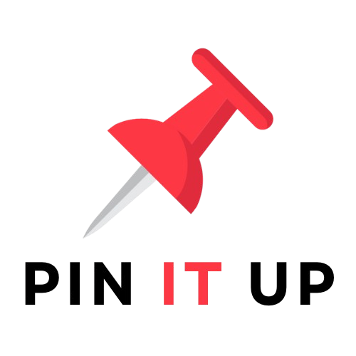

# Pinterest Clone - Pin It Up - with React & Sanity

> :speech_balloon: На русском:
> 
> 

<!-- TABLE OF CONTENTS -->

Table of Contents

<ol>
  <li>
    <a href="#about-the-project">About the Project</a>
    <ul>
      <li><a href="#key-features-include">Key Features Include</a></li>
      <li><a href="#built-with">Built With</a></li>
      <li><a href="#deployed-with">Deployed With</a></li>
    </ul>
  </li>
  <li><a href="#license">License</a></li>
</ol>

&nbsp;

<!-- ABOUT THE PROJECT -->
## About the Project

**Pin It Up** is a full-stack Pinterest clone enabling users to **share, save, and organize** pins (images) by categories.

Watch the video demo <a href="https://github.com/elizaveta-sm/pin-it-up/blob/main/assets/pin-it-up-desktop.mp4">here</a>. You'll have to download it first.

&nbsp;

### Key Features Include

:zap: Sign up, log in, and manage your profile.

:zap: Create new pins by uploading images, adding titles and descriptions, and categorizing them.

:zap: Save pins to your profile or simply download the images.

:zap: Discover new pins by browsing recommendations.

:zap: Comment on pins.

&nbsp;

### Built With

:zap: **Frontend**
* JavaScript, React, Redux Toolkit
* Vite, Tailwind CSS

:zap: **Backend**
* JavaScript
* Firebase, Sanity

&nbsp;

## License
Distributed under the MIT License. 

> See <a href="https://github.com/elizaveta-sm/pin-it-up/blob/main/LICENSE.md">LICENSE.md</a> for more information.

